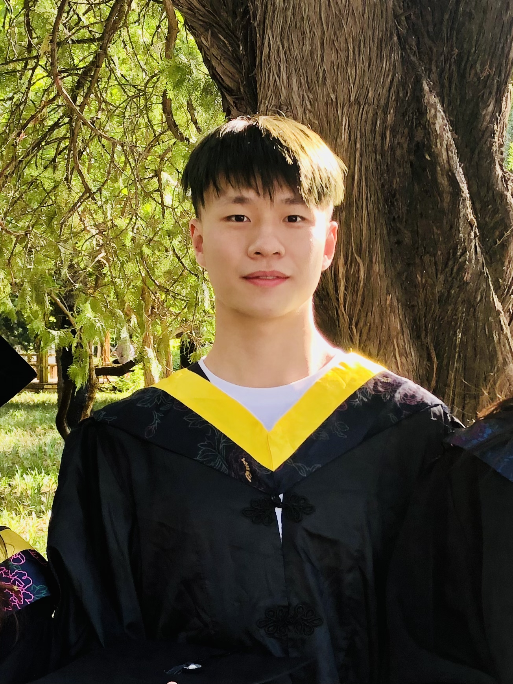

**Tiannuo Yang (杨天诺)**  
<!-- Master Student   -->
[Parallel and Distributed Software Technology Lab](https://nbjl.nankai.edu.cn/)   
[College of Computer Science](https://encc.nankai.edu.cn/), [Nankai University](https://en.nankai.edu.cn/)  
No.38 Tongyan Road, Tianjin, China, 300350

Email: <tiannuo_yang@126.com>; <yangtn@nbjl.nankai.edu.cn>

<!-- [📖](https://scholar.google.com/citations?user=TQFL5r4AAAAJ) -->

😎 09/2023 **Got** my first citation (by [Cai et al., 2023](https://www.sciencedirect.com/science/article/pii/S0957417423021024)) in my career!!!  
🆕 06/2023 **Started** academic cooperation interning at Ant Group (Beijing)  
<!-- 🆕 06/2022 **Graduated** officially from University of Science and Technology Beijing -->

[Google Scholar](https://scholar.google.com/citations?user=TQFL5r4AAAAJ) &nbsp;&nbsp;&nbsp;&nbsp; [DBLP](https://dblp.org/pid/356/7972.html) &nbsp;&nbsp;&nbsp;&nbsp; [ORCID](https://orcid.org/my-orcid?orcid=0000-0001-5465-9626)

---
#### BRIEF INTRO
I am currently a master student of Computer Science at Nankai University (NKU) with Prof. [Yusen Li](https://cc.nankai.edu.cn/2021/0323/c13619a516700/page.htm) as my advisor. 
My research interest lies in **learning approaches for computer systems**. Particularly, I am recently focusing on **optimizing the performance of vector database systems** for scenearios like large language models and knowledge retrieval. My research aims to design an optimally efficient and scalable optimization framework and provide flexible tradeoff between throuput and precision.

Before joining NKU, I received my BMgmt degree in Information Management and Information System from University of Science and Technology Beijing (USTB). My graduation thesis about **vehicle routing optimization** was further revised and [published by Elsevier](https://www.sciencedirect.com/science/article/abs/pii/S0038012123001775). 
I also participated in an one-year research project (i.e., coordinate optimization of complex systems based on deep learning) in University of Chinese Academy of Sciences (UCAS), where I studied data-driven time-dependent vehicle routing problems and multi-objective heuristic algorithms (advised by Prof. [Guanghui Zhou](https://people.ucas.ac.cn/~zhouguanghui?language=en)).

<!-- https://www.cs.purdue.edu/homes/choi293/index.html -->

---
#### RESEARCH INTERESTS

- Learning for computer systems
- Combinatorial optimization problems and heuristic algorithms
- Bayesian optimization and reinforcement learning

---
#### EDUCATION BACKGROUND

*08/2022-Present* &ensp; M.E. in Computer Science  
[Nankai University](https://en.ustb.edu.cn/), Tianjin, China  
Advisor: Prof. [Yusen Li](https://cc.nankai.edu.cn/2021/0323/c13619a516700/page.htm)

*08/2018-06/2022* &ensp; BMgmt in Information Management and Information System  
[University of Science and Technology Beijing](https://en.ustb.edu.cn/), Beijing, China  
GPA: 3.97/4.0

*09/2019-01/2020* &ensp; Exchange Program in Information Management  
[Southern Taiwan University of Science and Technology](https://www.stust.edu.tw/en/), Taiwan, China  
GPA: 4.0/4.0

---
#### INTERNSHIP PROJECTS
*06/2023-Present* &ensp; Academic Cooperation Intern  
[Ant Group](https://www.antgroup.com/en/), Beijing, China  
Summary: Learning-based optimization of industrial used DBMS

---
#### PUBLICATION LIST
**Tiannuo Yang**, Ruobing Chen, Yusen Li\*, Xiaoguang Liu, and Gang Wang  
[CoTuner: A Hierarchical Learning Framework for Coordinately Optimizing Resource Partitioning and Parameter Tuning](https://dl.acm.org/doi/10.1145/3605573.3605578)  
[52nd International Conference on Parallel Processing](https://icpp23.sci.utah.edu/) (ICPP '23)

**Tiannuo Yang\***, [Zhongzhu Chu](https://zhongzhu-chu.github.io/), and Bailin Wang  
[Feasibility on the Integration of Passenger and Freight Transportation in Rural Areas: A Service Mode and an Optimization Model](https://www.sciencedirect.com/science/article/abs/pii/S0038012123001775)  
[Socio-Economic Planning Sciences](https://www.sciencedirect.com/journal/socio-economic-planning-sciences) (2023) (SCI/SSCI, JCR Q1)

..., **Tiannuo Yang** (Co-first Author), ... and Xiaodong Zeng\*  
[On the Opportunities of Green Computing: A Survey](https://arxiv.org/abs/2311.00447)  
[arXiv](https://arxiv.org/) (2023) (Writing Section: 6.1 Resource Optimization)

---
#### ONGOING STUDIES
Wenhao Yang, **Tiannuo Yang**, Yusen Li\*, Gang Wang and Xiaoguang Liu  
Efficient Multi-GPU Parallel Pipeline Rendering Architecture (高效的多 GPU 并行流水线渲染架构)  
Submitted to [CCF ChinaSoft 2023](https://chinasoft.ccf.org.cn/)

**Tiannuo Yang**, XX, XX, XX  
Towards Auto-Configuring Distributed XX Database with High Search Speed and Recall Rate
